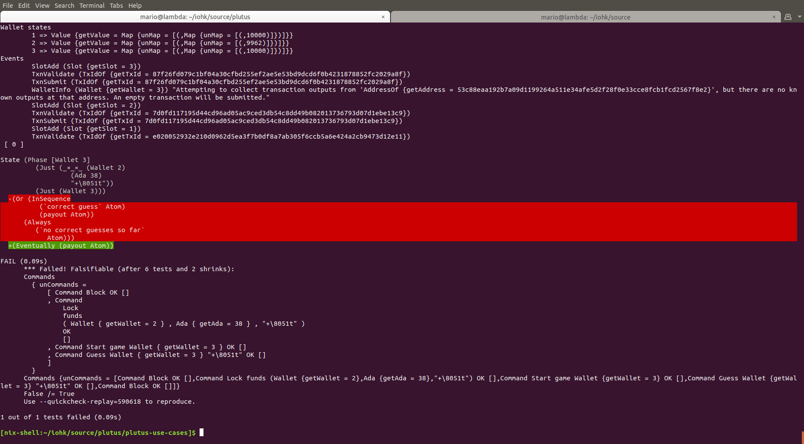
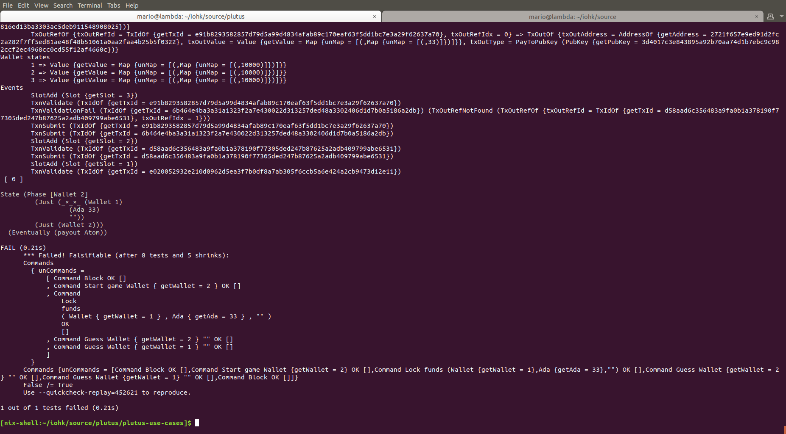
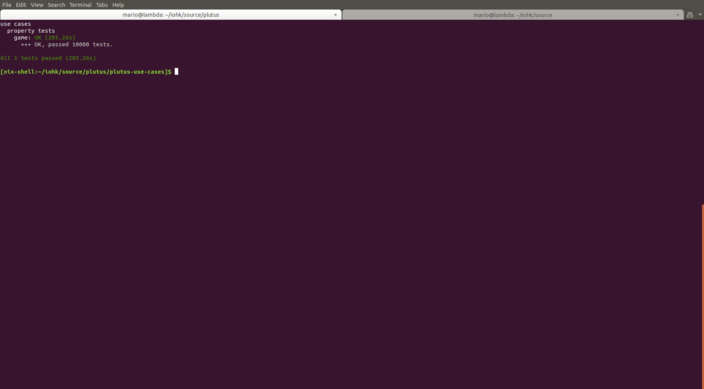

Property-testing made easy
=

This tutorial illustrates how to use the LTL utilities to do property testing on Plutus smart contracts.

The setting
=

We are going to be testing the [guessing game smart contract](
https://github.com/input-output-hk/plutus/blob/3785ed43fe66b59bb8ea3378c7942dfb0015e975/plutus-tutorial/doctest/Tutorial/02-validator-scripts.md
) as a running example, so some familiarity with it is important. At its bare minimum, this contract works
as follows:

1. One (or more!) players start watching the address of the game script by calling the `startGame` function.
2. The game host uses the `lock` function to set the target word that the players have to guess, as well as the payout for guessing correctly.
3. The players submit their guesses with `guess` and the first successful guess gets the prize!

This smart contract can be thought of as a state machine, where the previous methods represent transitions and
the state is just the entirety of the blockchain (or, at least, the parts of it that are relevant to us). What
we would like, then, is to check that any possible sequence of calls to these methods respects some abstract
properties (for example, if no player submits a guess, then nobody gets the money - certainly, we want to check
that, at the very least, if a player guesses the word correctly, then they will eventually get the money!).

This is precisely what the `quickcheck-state-machine` allows us to do: with it, we can specify rather complex
abstract state machines, and it takes care of generating and testing random sequences of commands for us.
If you're interested, you can read more about this
excellent library [here](
https://iohk.io/blog/an-in-depth-look-at-quickcheck-state-machine/
).

This library is, however, a bit too complex and unwieldy and includes many bells and whistles that we don't want
to concern ourselves about, and so rhe [LTL](../test/LTL.hs) and [LTL.Utils](../test/LTL/Utils.hs) modules provide us with all the tools we
need to do LTL-based property testing - we will only be covering them here, and no familiarity with
`quickcheck-state-machine` is necessary.

Specifying our state machine
=

The main entry points in the [LTL.Utils](../test/LTL/Utils.hs) module are the functions `makeSM` and `testSM`. Respectively, these
allow us to specify the behaviour of our system as a state machine (abstracting over all the boilerplate that
is required by `quickcheck-state-machine`). The resulting state machine can then be fed to `testSM` together
with a predicate written in a superset of [Linear Temporal Logic](
https://en.wikipedia.org/wiki/Linear_temporal_logic
), everyone's favourite specification language.

So we start by importing all the relevant modules:

```haskell
{-# LANGUAGE LambdaCase               #-}
{-# LANGUAGE TemplateHaskell          #-}

module LTL.Spec.Game where

import           Control.Lens                                  hiding (elements)
import           Control.Monad

import           Data.List
import           Data.Map                                      (Map)
import qualified Data.Map                                      as Map
import           Data.Maybe
import           Data.TreeDiff

import           Test.QuickCheck
import           Test.StateMachine.Logic                       (Logic (..))

import           Ledger
import qualified Ledger.Ada                                    as Ada
import           Wallet.API                                    (PubKey (..))
import           Wallet.Emulator

import qualified LTL
import           LTL.Utils

import           Language.PlutusTx.Coordination.Contracts.Game (guess, lock, startGame)
```

The two language extensions are just there for convenience and are not strictly
necessary, and most of the imports should be obvious. Of note, we need to import `LTL` and `LTL.Utils`, of course,
and all the smart contract methods that we will be testing (`guess`, `lock`, `startGame`). We're also importing
`Test.StateMachine.Logic`, which we will need in order to specify pre- and post-conditions in our state machine
(more on this later).

Now, in order to specify our state machine, we need to decide what the state will be. While the actual state
of the underlying state machine is actually more complex, and depends both on the blockchain and the formula
we are interested in checking, we get to specify a small part of it in order to help define our predicates and our
methods. I call this user-defined part of the state the "phase" of the state machine, and as a rule of thumb it
should be enough to:

* Allow us to check our LTL predicate (as our LTL formulae can only depend on the state of the blockchain and
whatever we specify as a phase).
* Allow us to generate valid random commands (more on this later!)

Since we are interested in verifying a guessing game, our phase will contain:

1. A list of all the players that are playing the game.
2. The parameters of the game: who is the host, how much is the prize, and what is the word to be guessed.
3. The player that has won the game (if any).

We would specify our phase like so:

```haskell
data Phase = Phase
    { _players :: [Wallet]
    , _game    :: Maybe (Wallet, Ada, String)
    , _winner  :: Maybe Wallet
    } deriving (Show)
makeLenses ''Phase
instance ToExpr Phase where
    toExpr (Phase p g w) = App "Phase" [ toExpr p, toExpr g, toExpr w ]
```

Again, this is mostly straightforward - the use of lenses is optional and we could've ommitted it, but it will
make our life much easier in the long run. We do need an instance for `ToExpr`, which lets
`quickcheck-state-machine` compute the diff between consecutive phases.

Now we need to define state machine versions of the three primitives in our smart contract: `lock`, `startGame`,
and `guess`, and we do this by creating objects of type `UserCommand`, which is parameterized over our particular
definition of a phase. This is best illustrated by example:

```haskell
lockFundsCmd :: Wallet -> Ada -> String -> UserCommand Phase
lockFundsCmd w ada str = UserCommand
    { cmdName = "Lock funds " ++ show (w, ada, str)
    , cmdPhase = game ?~ (w, ada, str)
    , cmdEffect = processEmulated $ void $ walletAction w (lock str ada) >> updateAll
    , cmdPrecondition = \p ->
            Boolean $ isNothing $ p^.game
    }
    where updateAll = processPending >>= void . walletsNotifyBlock wallets
```

The method `lockFundsCmd` defines a state machine transition corresponding to the game's `lockFunds` call. The
fields in this record are mostly self-explanatory:

1. `cmdName` is the printed representation of the command - very useful to debug things.
2. `cmdPhase` represents the effect of the command on the phase of the system, it lets us update the internal
state of the game every time this command is executed. In the case of the `lockFunds` command, we set up
the parameters of the game (and aren't you glad we used lenses now?).
3. `cmdEffect` is the concrete execution of the command, i.e. the actual call to the `lockFunds` mehtod.
4. `cmdPrecondition` lets us specify a precondition that has to be verified before the command can be
executed (if the precondition fails to hold, `quickcheck-state-machine` will try generating a different command
instead). This can depend only on the phase and must return a value of type `Logic` (an internal type
defined by `quickcheck-state-machine`, representing a predicate in propositional logic). In our case,
we don't want multiple players trying to host a game at the same time, so we specify that the command may
only be executed if there's no game currently in play.

Similarly, we set up state machine versions of our other methods:

```haskell
startGameCmd :: Wallet -> UserCommand Phase
startGameCmd w = UserCommand
    { cmdName = "Start game " ++ show w
    , cmdPhase = \phase -> phase & over players ([w] `union`)
    , cmdEffect = processEmulated $ void $ walletAction w startGame
    , cmdPrecondition = const Top
    }

guessCmd :: Wallet -> String -> UserCommand Phase
guessCmd w str = UserCommand
    { cmdName = "Guess " ++ show w ++ " " ++ show str
    , cmdPhase = \phase ->
            case phase^.game of
                Nothing -> phase
                Just (_, _, str')
                    | str == str' && w `elem` phase^.players -> phase & winner .~ w
                    | otherwise -> phase
    , cmdEffect = processEmulated $ void $ walletAction w (guess str)
    , cmdPrecondition = const Top
    }
```

The final piece we need is a way of generating these commands at random. A possibility would be to generate
completely random commands independently of the current phase, but in practice this might not be such a good idea,
since randomly generated `guess` commands are not very likely to be correct and so the huge majority of test
traces will end up only generating wrong guesses. We want to make sure that interesting cases aren't overly
unlikely!

For this, we need to implement a generator of type `Phase -> [Gen (UserCommand Phase)]` which gives a list of
command generators that apply at a given phase. For us, the main concern here is that we must make sure to
generate correct guesses every now and then - they will be too rare otherwise:

```haskell
generator :: Phase -> [Gen (UserCommand Phase)]
generator (Phase _ g _) = genLock ++ genStart ++ genGuess
    where genLock = pure $ lockFundsCmd <$> elements wallets <*> (Ada.fromInt <$> choose (1, 200)) <*> arbitrary
          genStart = pure $ startGameCmd <$> elements wallets
          genGuess = case g of
              -- Make sure not to guess the right answer twice!
              Just (_, _, str') -> [guessRight str', guessWrong str']
              _                 -> [randomGuess]
          randomGuess = guessCmd <$> elements wallets <*> arbitrary
          guessRight str = guessCmd <$> elements wallets <*> pure str
          guessWrong str = guessCmd <$> elements wallets <*> arbitrary `suchThat` (/= str)
```

Internally, the state machine that we will obtain can always decide to mint a new block instead of executing
any of the user-specified generators so the list of user-defined generators could be empty without the
state machine crashing because it can't generate any more actions.

An important note on generation: one might think that we could give a trivial precondition to every action and
simply not generate it when the precondition doesn't hold. This won't work, because the shrinking process will
eliminate actions at random, and so an action that was valid in the original trace might not be valid anymore
in the shrunk trace. So make sure to write your preconditions!

Finally, note that, while [LTL.Utils](../test/LTL/Utils.hs) makes this process mostly painless, we could have defined all
the transitions without it, relying directly on `quickcheck-state-machine` for finer control - it would still
be compatible with the testing mechanism that we'll use (provided that the internal state of your machine
adheres to the types that `testSM` expects)

Checking properties in linear temporal logic
=

Now, before we actually get to verify anything, we need, of course, a proposition to check! We will use linear
temporal logic to specify it - an in-depth introduction to LTL would be too long to write here, but let's at
least give a quick overview of the basic combinators we have at our disposal (from the [LTL](../test/LTL.hs) module):

```haskell
data Formula a = Grab (a -> Formula a)
               | And (Formula a) (Formula a)
               | Or (Formula a) (Formula a)
               | Not (Formula a)
               | Next (Formula a)
               | Always (Formula a)
               | InSequence [Formula a]
               | T
               | F
               | Label String (Formula a)
```

So we have our basic and/or/not/true/false that should be familiar to everyone, and a `Label` option to give
names to parts of our formulae to improve readability. The formula `Always f` just means that `f` is required
to hold at any point in time (i.e. after every state machine transition), and it is just the standard **G**
combinator from LTL. `Next f` is true if and only if `f` is true after the next state machine transition, again
just like **X** in LTL.

The `InSequence` and `Grab` combinators are slightly trickier: `InSequence [f_1, f_2, f_3...]` is true whenever
eventually `f_1` holds and then, after that, eventually `f_2` holds and so on. The "eventually" combinator
**F** from LTL can be implemented as simply `InSequence . pure` - strictly speaking, this combinator isn't
necessary and we could make do with an `Eventually` combinator, but it's included for readability and performance
reasons (evaluating `Eventually (And f_1 (Eventually f_2))` naively leads to an explosion in the size of the
formula).

Finally, `Grab` allows one to access information from some environment `a` (in our case, `a` will precisely
be a product of our `Phase` and the `EmulatorState`). We will mostly not need to use `Grab`, since we will only
be concerned with atomic propositions: the `atom` combinator does precisely this for us:

```haskell
atom :: (a -> Bool) -> Formula a
atom = Grab . (bool .)
  where bool True = T
        bool False = F
```

Equipped with all this, we can now write a reasonable property to check: either there is never a correct guess
or, if some player does correctly guess the secret word, then that player gets the prize:

```haskell
formula :: LTL.Formula (Phase, EmulatorState)
formula =
    LTL.InSequence [guessCorrect, payout] `LTL.or` LTL.Always incorrectGuess
    where guessCorrect = LTL.label "correct guess" $
              LTL.atom (\(phase, _) -> isJust $ phase^.winner)
          -- The payout is only positive if the wallet wasn't the host
          payout = LTL.Label "payout" $
                   LTL.atom (\case (Phase _ (Just (host, prize, _)) win, es) ->
                                       flip any win $
                                       \w -> funds w es ==
                                             if host == w
                                             then startingBalance
                                             else startingBalance <> Ada.toValue prize
                                   _ -> False)
          incorrectGuess = LTL.label "no correct guesses so far" $
              LTL.atom (\(phase, _) -> isNothing $ phase^.winner)
          nobodyGetsMoney = LTL.label "nobody receives the payout" $
              LTL.atom (\(_, es) -> any (\w -> funds w es <= startingBalance) wallets)
```

Now we can finally get to testing our property! All we need to do is set up a QuickCheck property by choosing
an initial emulator state and a minimum number of commands that we want generated (this feature is currently
broken, see [here](https://github.com/advancedtelematic/quickcheck-state-machine/issues/299)).

```haskell
initialPhase :: Phase
initialPhase = Phase [] Nothing Nothing

wallets :: [Wallet]
wallets = Wallet <$> [1 .. 3]

startingBalances :: Map PubKey Value
startingBalances = Map.fromList $ zip (walletPubKey <$> wallets) (repeat startingBalance)

startingBalance :: Value
startingBalance = Ada.adaValueOf 10000

gameSM :: MonadEmulator m => AbstractMachine Phase m
gameSM = makeSM wallets generator initialPhase formula

test :: Property
test = testSM gameSM (Just 30) es [Block]
    where es = emulatorStateInitialDist startingBalances
```

You can run this test using QuickCheck directly, or integrate it in a larger Tasty test suite - so let's try
and run the tests - and see what happens!



Oops - something went wrong! The output from `quickcheck-state-machine` can seem rather intimidating, but we
can see how the phase and formula to be verified change over time
(the output is helpfully color-coded so we can see what parts are added and removed at every time step - you
can find the full output [here](log/player_start_after_lock)).
In this case, the phase is `Phase [Wallet 3] (Just (Wallet 2, Ada 38, "+\8051t")) (Just (Wallet 3))`, so we know
that `Wallet 3` has submitted a correct guess - indeed the formula has been updated to reflect this: the
`LTL.Always incorrectGuess` branch has been falsified and pruned, and the `guessCorrect` part has been updated
to reflect that someone has indeed submitted a correct guess, so our state machine is now waiting for the payout
to happen - but it never does, as we can see from the wallet states printed above!

We also see the sequence of commands that led to this situation (and thanks to shrinking, it is a rather small
trace!), so we can already identify what the problem is: `Wallet 3` called the `startGame` method *after*
the game was set up by `Wallet 2`!

This isn't a bug in the contract per se, but an oversight in the development of our abstract machine. We need
to make sure that only the wallets that `startGame` before a `lock` are counted as players, so we update our
definition for `startGameCmd`:

```haskell
startGameCmd :: Wallet -> UserCommand Phase
startGameCmd w = UserCommand
    { cmdName = "Start game " ++ show w
    , cmdPhase = \phase ->
            -- Users can only join a game before it starts
            case phase^.game of
                Nothing -> phase & over players ([w] `union`)
                Just _  -> phase
    , cmdEffect = processEmulated $ void $ walletAction w startGame
    , cmdPrecondition = const Top
    }
```

Time to test our smart contract again! Does it work now? Well, not quite!



Again, you can see the full log [here](log/host_wins), but this tiny peek is already enough to see what's going
on - the game was hosted by `Wallet 1` which then proceeded to submit the right answer and win the game (we can
see that `Wallet 1` is back to the initial balance of `10000`), but since the host is not counted as being an
active player, our abstract machine didn't count the win and expected `Wallet 2` to be the winner instead!

This illustrates three more flaws in our model: evidently the host should be counted as an active player, but
we also need to consider the possibility that more than one player might submit the correct answer within the
same block (as it was the case in this example) - in which case we can't be certain of which one will actually
be the winner. Finally, we expect the winner to end up with more funds than they started with, but this is only
true if the game isn't won by the host, as in this case the "payout" will just amount to a refund.

Fixing these just requires small changes to the phase (so that we may record more than one winner at a time) and
judicious updates to `lockFunds` and the target formula itself:

```haskell
data Phase = Phase
    { _players :: [Wallet]
    , _game    :: Maybe (Wallet, Ada, String)
    , _winners :: [Wallet] -- More than one player may make the same correct guess within a block!
    } deriving (Show)

formula :: LTL.Formula (Phase, EmulatorState)
formula =
    LTL.InSequence [guessCorrect, payout] `LTL.or` LTL.Always incorrectGuess
    where guessCorrect = LTL.label "correct guess" $
              LTL.atom (\(phase, _) -> not $ null $ phase^.winners)
          -- The payout is only positive if the wallet wasn't the host
          payout = LTL.Label "payout" $
                   LTL.atom (\case (Phase _ (Just (host, prize, _)) win, es) ->
                                       flip any win $
                                       \w -> funds w es ==
                                             if host == w
                                             then startingBalance
                                             else startingBalance <> Ada.toValue prize
                                   _ -> False)
          incorrectGuess = LTL.label "no correct guesses so far" $
              LTL.atom (\(phase, _) -> null $ phase^.winners)

lockFundsCmd :: Wallet -> Ada -> String -> UserCommand Phase
lockFundsCmd w ada str = UserCommand
    { cmdName = "Lock funds " ++ show (w, ada, str)
    -- Whoever hosts the game is automatically an active player
    , cmdPhase = (game ?~ (w, ada, str)) . over players ([w] `union`)
    , cmdEffect = processEmulated $ void $ walletAction w (lock str ada) >> updateAll
    , cmdPrecondition = \p ->
            Boolean $ isNothing $ p^.game
    }
    where updateAll = processPending >>= void . walletsNotifyBlock wallets

guessCmd :: Wallet -> String -> UserCommand Phase
guessCmd w str = UserCommand
    { cmdName = "Guess " ++ show w ++ " " ++ show str
    , cmdPhase = \phase ->
            case phase^.game of
                Nothing -> phase
                Just (_, _, str')
                    | str == str' && w `elem` phase^.players -> over winners ([w] `union`) phase
                    | otherwise -> phase
    , cmdEffect = processEmulated $ void $ walletAction w (guess str)
    , cmdPrecondition = const Top
    }
```

Finally it seems that our model is correct and, after some wait (go make yourself some coffee!) we are greeted
by a reassuring green message!



Of course this doesn't really guarantee that our contract is correct, but 10.000 different traces
without running into any bugs should at least be enough to let us sleep calmly at night!
